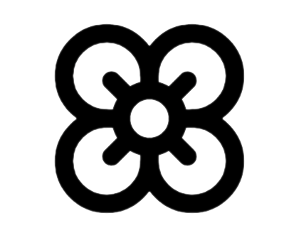

<div align="center">
  
</div> 

<div align='center'> 

## Íris Open-Source Blog Template

</div>
 
Íris is an open-source Markdown-based blog template built with Next.js and Shadcn UI. It is designed to be simple and flexible, allowing you to build your own blog with ease and customization. Turn your notes into a blog effortlessly.

Features:

- SEO optimization 🔍
- Markdown-based 🗒
- RSS feed 📶
- Image optimization ⚡
- GitHub as CMS 😺

## Install 

```shel 
npm create next-app --example https://github.com/Ianmello10/Iris blog
```


